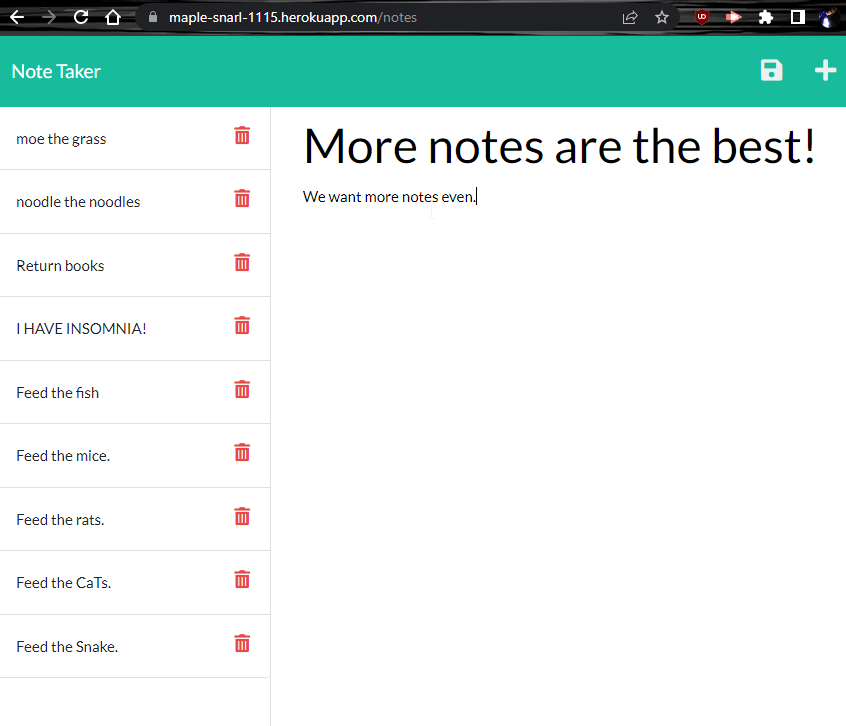

# 11 - Note Taker Express App
# Submitted by Conor Donnelly - November 15, 2022

This challenge required us to create Express API routes on the back end in order to support a note taking app that had been provided to us as starter code on the front end. The challeng also required us to deploy the application to the Heroku platform where the Node and Express can be detected and run on the server for us.

See the deployed application at:
https://maple-snarl-1115.herokuapp.com/

1st) Click the "Get Started" button on the landing page

2nd) Click on the PLUS icon in the header to add a new note. Then click "Note Title" to add a title, and "Note Text" to enter note details. Then click the save icon that appears in the header.

    ##The server recieves an API POST request to add the new note and writes it to the db.json file.

3rd) Click on a any note in the list to display the details in the main page.

4th) Click on the trash icon besides any note in the list to remove it.

    ##At this point the server recieves an API DELETE request, we have to use the filter array method in order to open the json file and find all the notes that do NOT match the UUID of the selected note and then save the filtered file back to the server.

## Screenshot

